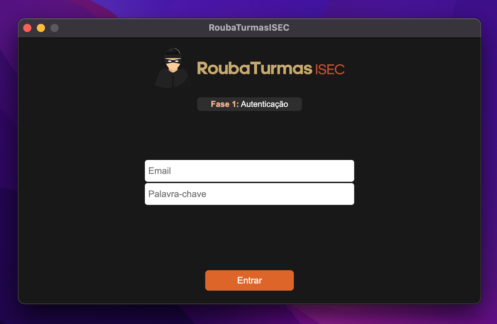

<h1 align="center">
  </a>
</h1>

<h4 align="center">A CLI/GUI to shotgun classes from InforEstudante platform</h4>

<p align="center">
  <a href="https://badge.fury.io/js/electron-markdownify">
    
  </a>
  <a href="https://gitter.im/amitmerchant1990/electron-markdownify"></a>
  <a href="https://saythanks.io/to/bullredeyes@gmail.com">
      
  </a>
  <a href="https://www.paypal.me/AmitMerchant">
    
  </a>
</p>

<p align="center">
  <a href="#key-features">Key Features</a> •
  <a href="#how-to-use">How To Use</a> •
  <a href="#download">Download</a> •
  <a href="#credits">Credits</a> •
  <a href="#special-thanks">Special Thanks</a>
</p>



## Key Features

* Shotgun classes from InforEstudante before any of the other students
* Multi-threaded which means you can shotgun classes from different subjects at the same time
* Select multiple classes by order of preference
* Quickly and easily configurable through a JSON file
* Simple CLI that requires almost zero effort to use
    - Also available in the form of a Graphical User Interface (GUI) if you are not too into consoles and that kind of stuff
> **UPCOMMING**: feature to keep application trying to subscribe to a class until successful

## How To Use
### CLI
To run this application you will only need to have [Python](https://www.python.org/downloads/) 3.0.0 or higher installed on your computer.
<br>
Download **rouba_turmas.py** and **config.json** from the releases page and you are good to go, just run `python rouba_turmas.py` and the classes are all yours!
* Be sure to place the script and the JSON file in the same directory

Some libraries were used so you will need to install them using pip. To do so, grab **requirements.txt** and run one of the following commands on a terminal:
```bash
# install thorugh requirements.txt
$ pip install -r requirements.txt

# or just run this command
$ pip install bs4 lxml requests
```

Before launching the script you will need to edit the **config.json** file to fit your needs. 
Here is a example configuration:
```json
{
    "domain": "inforestudante.ipc.pt",
    "student_number": "a2020143845",
    "classes": [
        {
            "name": "Arquiteturas Móveis",
            "practice": ["P2", "P3"],
            "theoric": ["T1"],
            "theoric_practice": []
        } //, add more subjects using the same format
    ]
}
```
* `domain`: the domain of your institution (only InforEstudante is supported)
* `student_number`: your student number/email
* `classes`: array of classes
  - `name`: name of the subject
  - `practice`: ID of practice class (ordered by preference)
  - `theoric`: ID of theoric class (ordered by preference)
  - `theoric_practice`: ID of theoric_practice class (ordered by preference)


<br>
After launching the script, it will show you what's happening behind the curtains as it goes and hopefully by the end you will have the classes you wanted the most :)


### GUI
To clone and run this application, you'll need [Git](https://git-scm.com) and [Node.js](https://nodejs.org/en/download/) (which comes with [npm](http://npmjs.com)) installed on your computer. From your command line:

```bash
# Clone this repository
$ git clone https://github.com/Asuryu/RoubaTurmasISEC

# Go into the repository
$ cd RoubaTurmasISEC
$ cd app

# Install dependencies
$ npm install

# Run the app
$ npm start
```

> **Note:**
> If you do not want to follow the previous approach, you can always download a build of the application from the [releases](https://github.com/Asuryu/RoubaTurmasISEC/releases) page.


## Download

You can [download](https://github.com/Asuryu/RoubaTurmasISEC/releases) the latest version of RoubaTurmasISEC for every platform that runs Python.
> **Note:**
> For the GUI version, only Windows and Mac is supported

## Credits

This software uses the following open source packages:

- [Electron](http://electron.atom.io/)
- [Node.js](https://nodejs.org/)

## Special Thanks
I extend my gratitude to those who helped this project become a reality:
<div style="display: flex; align-items: middle;">
  <a href="https://github.com/IamM47Z">IamM47Z</a>
</div>
<div style="display: flex; align-items: middle;">
  <a href="https://github.com/Yeshey">Yeshey</a>
</div>
